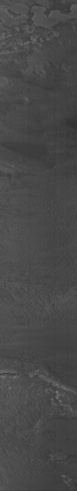
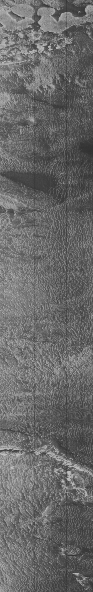
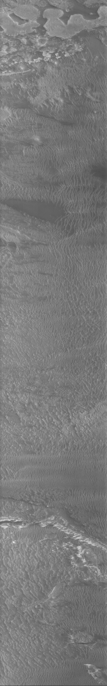

# MGS
Mars Global Surveyor image optimizer (https://science.nasa.gov/mission/mars-global-surveyor/)

An utility/tool to remove/attenuate vertical bands artifacts from MGS images.

The MOC Narrow Image CCD array sensor was a mess. The data needs to be calibrated. The main problem is the presence of vertical lines, because the uncalibrated optical array

In the year 2000 I decided to do the tool by myself. 
Supposed the mean of the luminosity of the vertical, adjacient, strips is similar the tool normalizes the luminosity of each vertical line, using the mean luminosity from the adjacient N lines.

The tool can process RAW images from nasa archives available here: (https://asimov.msss.com/moc_gallery/)

# GALLERY:

 
M0202556.imq Raw - unprocessed  

 
 
***
***
***

M0202556 Raw image - contrast enhanced
 
 

***
***
***

M0202556 - processed and palette stretched by MGS tool

 
 
NOTE: original coded in Delphi, adapted in 2025 to use Lazarus 

TESTED ON WINDOWS / LAZARUS 
