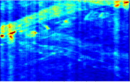
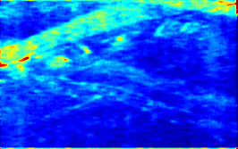
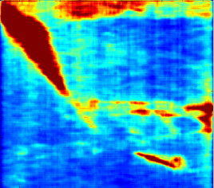
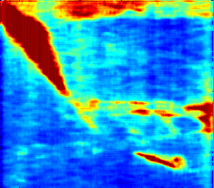
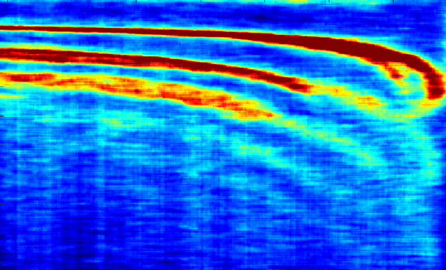
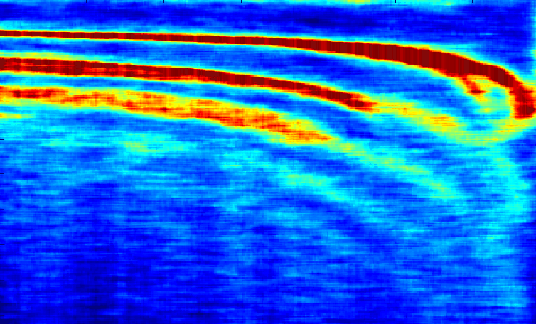

# SVD
Sar Vertical Destriper

An utility/tool to remove/attenuate vertical bands artifacts from SAR tomography images.
Tested from Filippo Biondi site (https://www.harmonicsar.com/) and from the Biondi/Malanga Giza paper (https://arxiv.org/abs/2208.00811).
   

The images can be captured directly with the windows "Capture Tool" and saved as .png. In the gallery you can see the first results using grabbed images - not from original data.
The ispiration was coming from a very antique tool I created long time ago for eliminating similar artifacts from raw, uncalibrated,  CDD satellite imagery from Mars Global Surveyor (MGS).
Supposed the mean of the luminosity of the vertical, adjacient, strips is similar the tool normalizes the luminosity of each vertical line, using the mean luminosity from the adjacient N lines.

Thanks to chat GPS the v 1.0 is publicly available.

Octvae:

The file sar_conversion.m can be tested and launched directly in Octave GUI.
The launching parameters can be edited/modified directly in the script   
The parameter usage is the same as Python version - see below 

Python:
 * Python and packages listed in the first lines of the script
 * Image.png to enhance
 * colorbar.png to correctly map values
  
Phyton usage examples:
  ### Image directly converted in B/W, then elaborated 
> python3 sar5.py --bw_input SanGottardo.png --colorbar colorbar.png --output SanGottardo --N 10

 ### Image levels mapped on colorbar.png ( converted to BW / elaborated / reconverted to color) 
> python3 sar5.py --input GranSasso.png --colorbar colorbar.png --output GranSasso --N 10

### NOTE:
for colorized images captured directly from Biondi/Malanga paper, the 'colorbar.gif' is required - see colorbar.png in the image folder.
This is used for the normalization of colours in levels (0-1 / BW) used internally to elaborate the image.  

# GALLERY:

 
 Figure #32 from Filippo Biondi / Corrado Malanga paper
 
 
 
 SVD filtered
 
 

***

Figure #33 from Filippo Biondi / Corrado Malanga paper
 
 
 
 SVD filtered
 
 

***

Ataturk from Filippo Biondi site
 
 
 
 SVD filtered
 
 

***

 
 Gran Sasso - from Filippo Biondi site
 
 
 
 Gran Sasso SVD filtered
 
 

***

 San Gottardo - Original - from Filipo Biondi site
 
 
 San Gottardo SVD filtered 
 
 

 ***
 
 San Gottardo - TOP LEFT CORNER - ORIGINAL  
 
 
 
 San Gottardo SVD - TOP LEFT TEST - POSSIBLE RESULT IN V2.0 - DYNAMIC VERTICAL WINDOW
 
 

***

Another, better, version maybe will be coming in the future.

 TESTED ON WSL / UBUNTU 
